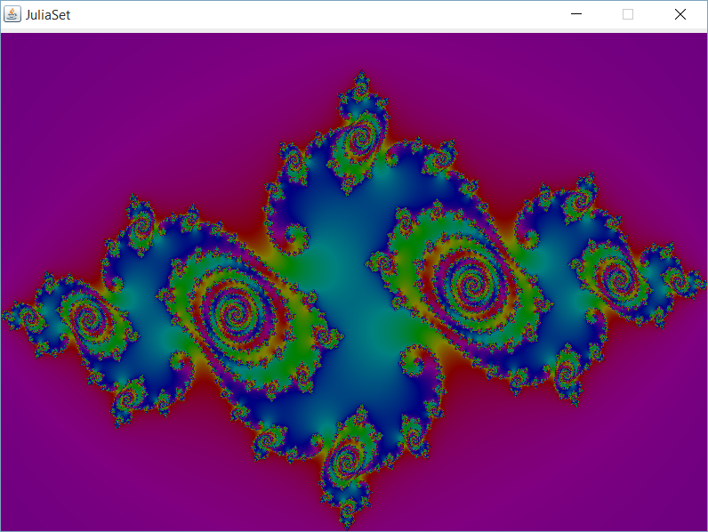
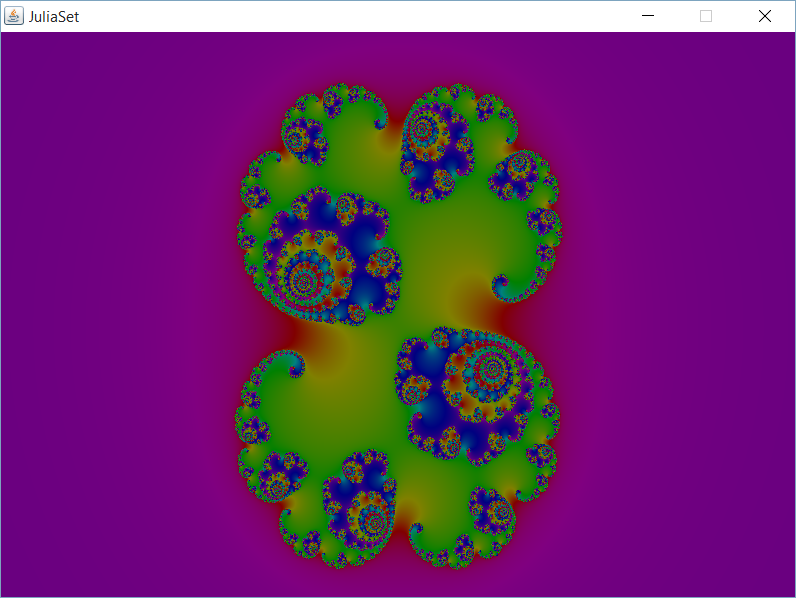
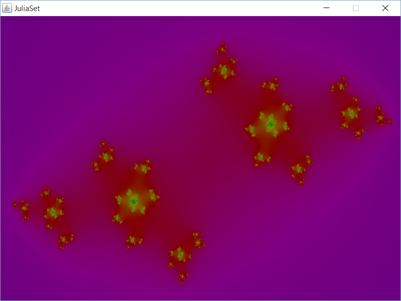

# JuliaSet

## Introduction

Dans le cadre de la licence informatique à Strasbourg nous avons pu réaliser un projet de génération de paysage. Une implémentation qui a été choisie fût la création d'un julia set, afin de pouvoir créer un paysage surréaliste.

## Explications

Un Julia set est une figure mathematique utilisant les nombres complexes et est de type fractale. Plus précisement en réalisant une récursivité de l’équation : zn+1 = zn² + C, avec z et C des nombres complexes. Comme un Julia set est une fractale il est tout a fait possible de zoomer à l’infini dans le Julia set genéré et de pouvoir observer les similarités peu importe l’endroit ou l’on se situe. 

## Interface et raccourcis

Lorsque la touche Echap est appuyé, apparaît alors un menu qui permet de gérer le décalage vers la droite, gauche, le zoom, et également quelle est la valeur
de C a utiliser lors des calculs.  
En effet c’est la valeur de C qui détermine l’apparence du Julia set. Les touches a utiliser sont ctrl+6 pour dézoomer, ctrl+= pour zoomer, et les touches directionnelles pour monter descendre, se deplacer à droite ou à gauche. L’application, pour permettre davantage de performances, est threadable et on peut choisir le nombre de threads à
utiliser dans le menu de demarrage. 

## Rendu

En prenant C = -0.75 + 0.11i :

</img>

En C = 0.285 + 0.01i :

</img>

En prenant C = -0.8 + 0.6i :

</img>

## Algorithme

Julia set est calculé suite à une itération correspondant à zn+1 = zn² + C. z0 est le point que l'on désire calculé. Si au cours de l'itération la distance reliant zn au centre est supérieur à 2 alors le point ne fait pas partie du Julia set.  
Un Julia set est donc un ensemble de points qui ne s'échappent pas lors de l'itération. Pour que le Julia set puisse être calculé il faut limiter le nombre d'itérations à réaliser, plus le nombre est grand, plus le dessin à l'arrivée est précis. Ici le nombre maximum d'itérations est égal à 1000. 

La méthode de coloration utilisé est la méthode d'Escape Time Algorithm, qui consiste à calculer la couleur en fonction du nombre d'itérations réalisées avant la sortie de la boucle. Cette méthode possède l'inconvénient d'afficher des bandes de couleur, donc pour palier à cet effet nous avons utiliser la méthode du smooth coloring( smoothcolor += exp(- distance entre zn et centre) pour chaque tour dans la boucle.

## Compilation

javac *.java
Pré-requis : Installation préalable d'un JDK

## Execution

Usage : java Projet &lt;largeur&gt; &lt;hauteur&gt; (&lt;nombre de thread&gt;)

## Credits

Projet réalisé avec l'aide de Melina Angelo et de Juvena Muharremaj.
